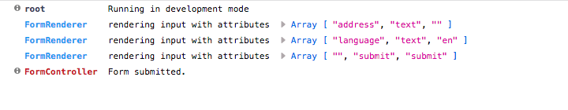

# py-logging-browserkit
Logging tool for browser platform (extension for [py-logging][1]).

Produces output like this (default):


Or (configured):



## Usage
*You need [py-logging][1] module ready for browser (with [Browserify][2] for example).*
```html
<script src="./build/py-logging.bundle.js"></script>
<script src="./build/browserkit.min.js"></script>
<script>
  py_logging_browserkit.install(logging);
  
  logging.info('Hello!');
</script>
```

[1]: https://github.com/jose-pleonasm/py-logging
[2]: http://browserify.org/
